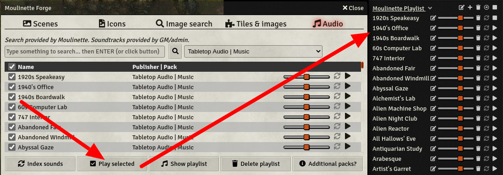
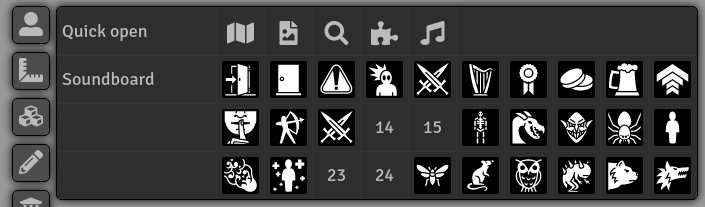

# Moulinette Forge Sounds (Foundry VTT)

This is a submodule for [Moulinette Core](https://github.com/SvenWerlen/moulinette-core). See [Moulinette Core](https://github.com/SvenWerlen/moulinette-core) for an overview of all modules.

## Bring your own sounds and manage them

You created or downloaded some sounds you'd like Moulinette to manage for you?
* Put them in `moulinette/sounds/custom` folder.
* Make sure to have at least a 2-depth structure (1. Publisher, 2. Pack, 3+ Sounds)
* Index sounds
* Moulinette lets you now search or browse sounds
 * Play a sound *on-the-fly*
 * Select sounds and create a playlist

 _(Ambience sounds on the screenshot have been downloaded from [Tabletop Audio](https://tabletopaudio.com/) which are licensed under a [Creative Commons Attribution-NonCommercial-NoDerivatives 4.0 International](https://creativecommons.org/licenses/by-nc-nd/4.0/) License.)_

## Create a soundboard

You can also create your own soundboard. 
* Sounds can be added by clicking on the "favorite" icon (Moulinette Forge | Audio)
* Moulinette adds a new control on the top left corner for opening the soundboard
* Simply click on the sound to play it
* Sounds can be modified or moved on the soundboard

 _(Icons on the screenshot are from [Game-icons.net](https://game-icons.net/) and are provided under [CC BY 3.0](https://creativecommons.org/licenses/by/3.0/) license.)_

## <a name="install"/>Install the module

To **install** the module from FoundryVTT:
1. Start FVTT and browse to the Game Modules tab in the Configuration and Setup menu
2. Search for "Moulinette Forge" and click install on the desired module

To **manually install** the module (not recommended), follow these instructions:

1. Start FVTT and browse to the Game Modules tab in the Configuration and Setup menu
2. Select the Install Module button and enter the following URL: https://raw.githubusercontent.com/svenwerlen/moulinette-sounds/master/module.json
3. Click Install and wait for installation to complete 

## <a name="support"/>Support me on Patreon

If you like my work and want to support me, consider becoming a patreon!

[https://www.patreon.com/moulinette](https://www.patreon.com/moulinette)

You can also join [Moulinette Discord](https://discord.gg/xg3dcMQfP2)
